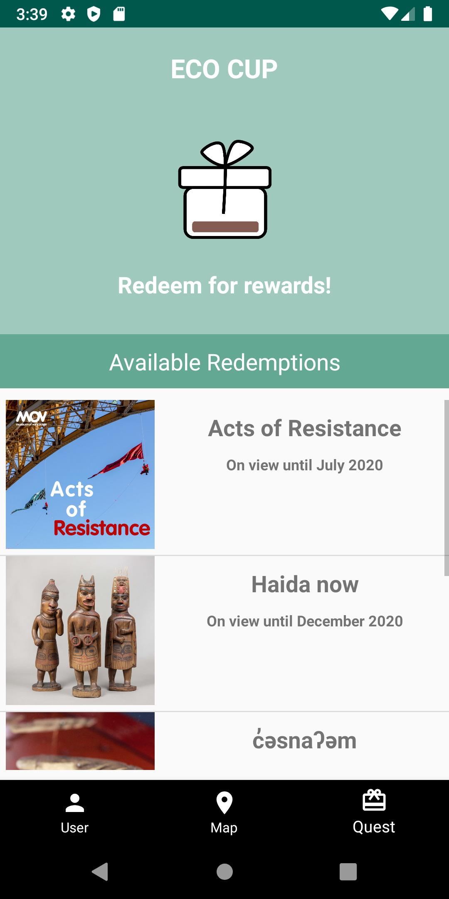
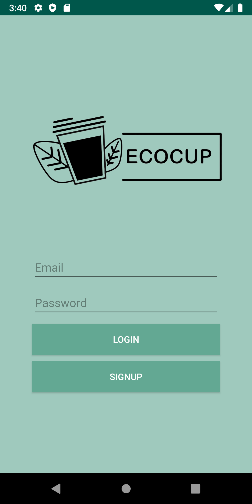
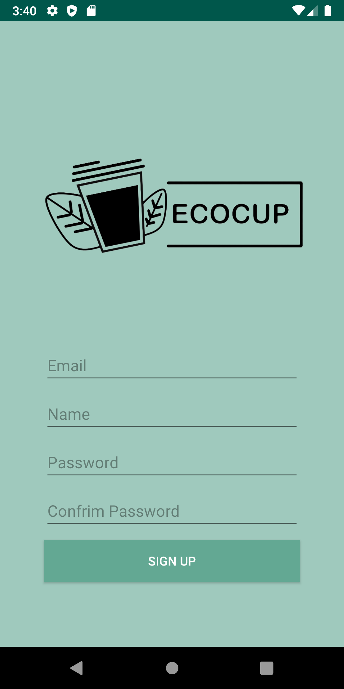
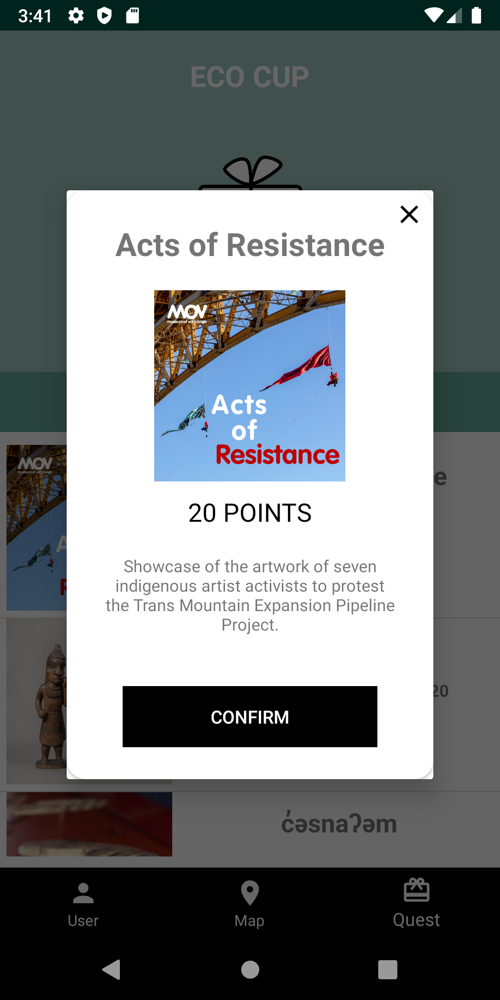
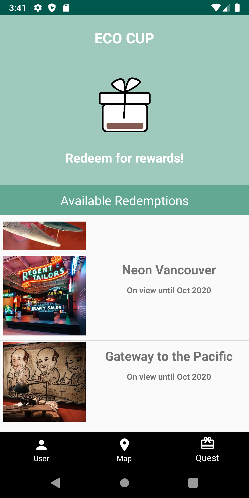
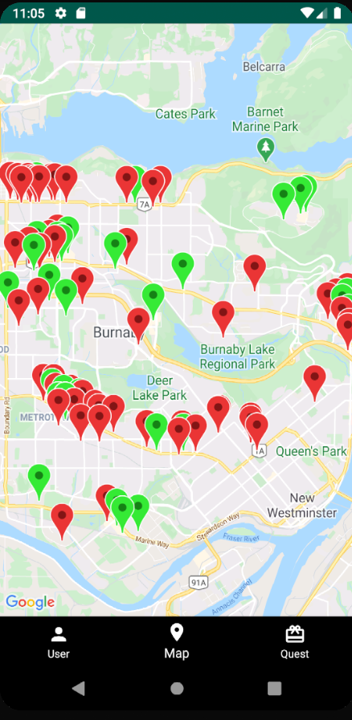
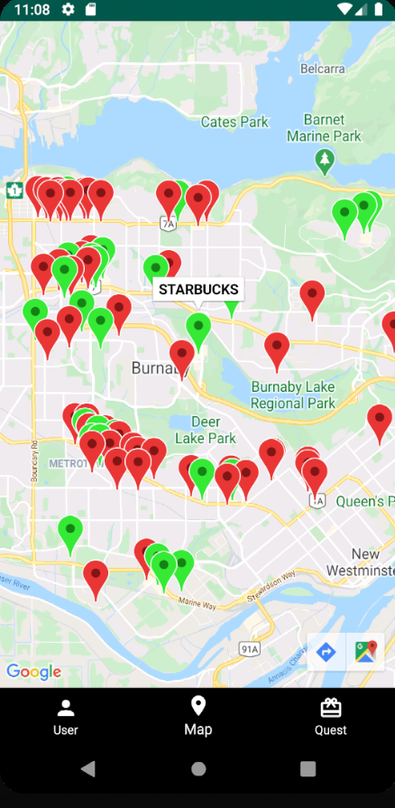

# ECOCUP
Ecocup is a project done as a final project for the course COMP 3717. 
The Android App provides incentives for users to bring reusable bottles to cafe and other places selling drinks

## Table of contents
* [General info](#general-info)
* [Screenshots](#screenshots)
* [Technologies](#technologies)
* [Setup](#setup)
* [Features](#features)
* [Status](#status)
* [Contact](#contact)

## General info
[Presentation & Demo Video](https://drive.google.com/file/d/1BG-1qQlB3jS-MF2Db7boiFdKK5l_SaKG/view?usp=sharing)

## Screenshots

## Technologies
* Java 
* Firebase Realtime Database
* Google Maps 
* City of Burnaby Open Data 

## Setup
Download ecocup.apk and install on an android device

## Features
* Search participating cafe or coffee shops.
* Create profile to keep track of reward points.
* Redeem rewards at participating locations.
* Gain rewards by scanning a QR code when user brings a reusable bottle to a cafe.

## Status
Project is: _finished_

## Contact
Created by 
* [@jasonwei0224](https://github.com/jasonwei0224)
* [@SangwookYun](https://github.com/SangwookYun)
